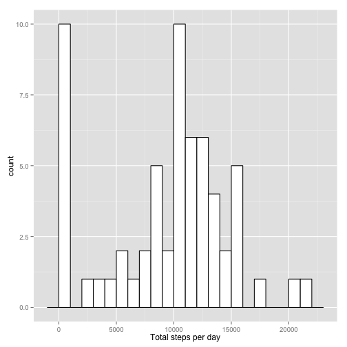
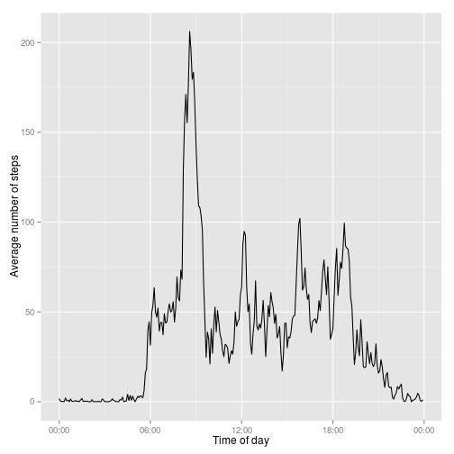
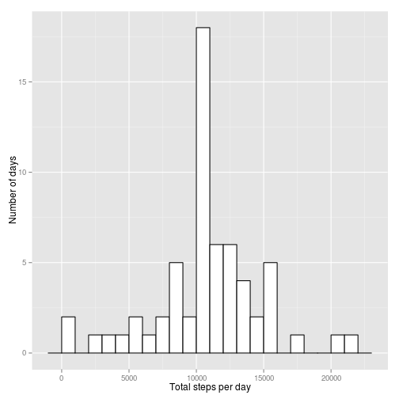
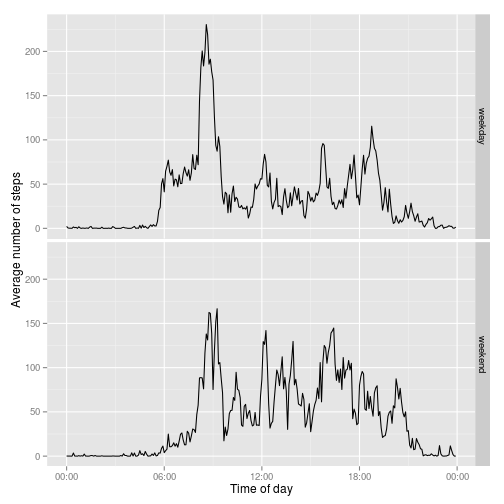

---
output:
  html_document:
    keep_md: yes
---
# Reproducible Research: Peer Assessment 1

## Loading and preprocessing the data


```r
library(plyr)
library(methods)
library(ggplot2)
library(scales)

url <- 'https://d396qusza40orc.cloudfront.net/repdata%2Fdata%2Factivity.zip'
zip_file <- 'activity.zip'
csv_file <- 'activity.csv'

if (!file.exists(zip_file)) download.file(url, zip_file, method = 'curl')
if (!file.exists(csv_file)) unzip(zip_file)
activity.df <- read.csv(csv_file)

activity.df$date <- as.Date(activity.df$date)
activity.df$time <- strptime(sprintf('%04d', activity.df$interval), '%H%M')
no_missing.df <- na.omit(activity.df)
```

## What is mean total number of steps taken per day?


```r
days <- ddply(no_missing.df, 'date', summarise,
              total_steps = sum(steps))
ggplot(days, aes(x=total_steps)) +
  geom_histogram(binwidth = 1000, fill='white', colour='black') +
  xlab("Total steps per day") +
  ylab("Number of days")
```

 


```r
mean_steps_per_day <- mean(days$total_steps)
median_steps_per_day <- median(days$total_steps)
```

The mean total number of steps per day was 10766.19, while the median was 10765.

## What is the average daily activity pattern?


```r
intervals <- ddply(no_missing.df, c('time', 'interval'), summarise,
                   avg_steps = mean(steps))
ggplot(intervals, aes(x=time, y=avg_steps)) +
    geom_line() +
    xlab("Time of day") +
    ylab("Average number of steps") +
    scale_x_datetime(labels = date_format("%H:%M"))
```

 

```r
max_steps <- max(intervals$avg_steps)
max_interval <- format(intervals[intervals$avg_steps == max_steps, 'time'], '%H:%M')
```

The interval 08:35 contains the maximum number of steps (206.1698) on average across all the days in the dataset.

## Imputing missing values


```r
missing_count <- sum(is.na(activity.df$steps))
na_per_day <- ddply(activity.df, 'date', summarise, na_cnt = sum(is.na(steps)))
days_with_na <- nrow(subset(na_per_day, na_cnt > 0, 'date'))
entirely_missing_days <- nrow(subset(na_per_day, na_cnt == 288, 'date'))
partially_missing_days <- nrow(subset(na_per_day, na_cnt > 0 & na_cnt < 288, 'date'))
```

There are 2304 rows where the number of steps is missing.  The number of days where at least one interval is missing (8) and the days where all intervals are missing (8) are the same, there are 0 partially missing days.

Therefore missing values cannot be imputed by the mean number of steps for the day, since the mean for these days is not known.  For further analysis, missing values were filled in by the mean number of steps for the respective 5-minute interval over the entire dataset.


```r
filled.df <- merge(activity.df, intervals)
na <- is.na(filled.df$steps)
filled.df[!na, 'steps_filled'] <- filled.df[!na, 'steps']
filled.df[na, 'steps_filled'] <- filled.df[na, 'avg_steps']
days2 <- ddply(filled.df, 'date', summarise,
               total_steps = sum(steps_filled, na.rm = T))
ggplot(days2, aes(x=total_steps)) +
  geom_histogram(binwidth = 1000, fill='white', colour='black') +
  xlab("Total steps per day") +
  ylab("Number of days")
```

 

Imputing missing values increased the total number of steps in the dataset: the frequency count of the 10000-11000 bin, which contains the mean total number of steps per day (10766.19), was increased by 8.  The number days with any other number of steps did not change.


```r
mean_steps_per_day2 <- mean(days2$total_steps)
mean_increase <- mean_steps_per_day2 - mean_steps_per_day
median_steps_per_day2 <- median(days2$total_steps)
```

Since missing values were filled by using the mean, the mean was expected not to change (actual change: 0).  The median increased to 10766.19.


## Are there differences in activity patterns between weekdays and weekends?


```r
weekend <- weekdays(c(as.Date('2000-01-01'), as.Date('2000-01-02')))
filled.df$weekend <- factor(weekdays(filled.df$date) %in% weekend,
                            levels = c(F, T),
                            labels = c('weekday', 'weekend'))
intervals <- ddply(filled.df, c('weekend', 'time'), summarise,
                           avg_steps = mean(steps_filled))
ggplot(intervals, aes(x=time, y=avg_steps)) +
    facet_grid(weekend ~ .) +
    geom_line() +
    xlab("Time of day") +
    ylab("Average number of steps") +
    scale_x_datetime(labels = date_format("%H:%M"))
```

 

Activity on weekends seems to start more gradually and is more uniform throughout the day than on weekdays.
