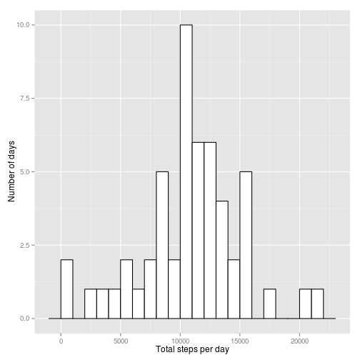

---
output:
  html_document:
    keep_md: yes
---
# Reproducible Research: Peer Assessment 1

## Loading and preprocessing the data


```r
library(plyr)
library(methods)
library(ggplot2)

url <- 'https://d396qusza40orc.cloudfront.net/repdata%2Fdata%2Factivity.zip'
zip_file <- 'activity.zip'
csv_file <- 'activity.csv'

if (!file.exists(zip_file)) download.file(url, zip_file, method = 'curl')
if (!file.exists(csv_file)) unzip(zip_file)
activity.df <- read.csv(csv_file)

activity.df$date <- as.Date(activity.df$date)
```

## What is mean total number of steps taken per day?


```r
days <- ddply(activity.df, 'date', summarise,
              total_steps = sum(steps, na.rm = T))
ggplot(days, aes(x=total_steps)) +
  geom_histogram(binwidth = 1000, fill='white', colour='black') +
  xlab("Total steps per day")
```

 


```r
mean_steps_per_day <- mean(days$total_steps)
median_steps_per_day <- median(days$total_steps)
```

The mean total number of steps per day was 9354.2295, while the median was 10395.

## What is the average daily activity pattern?


```r
intervals <- ddply(activity.df, 'interval', summarise,
                   avg_steps = mean(steps, na.rm = T))
plot(intervals$interval, intervals$avg_steps, type = 'l',
     main = 'Daily activity pattern',
     xlab = 'Interval',
     ylab = 'Average number of steps')
```

 

```r
max_steps <- max(intervals$avg_steps)
max_interval <- intervals[intervals$avg_steps == max_steps, 'interval']
```

The interval 835 contains the maximum number of steps (206.1698) on average across all the days in the dataset.

## Imputing missing values


```r
missing_count <- length(which(is.na(activity.df$steps)))
```

There are 2304 rows where the number of steps is missing.


```r
filled.df <- merge(activity.df, intervals)
fill_steps <- function(row) {
  if (is.na(row['steps'])) row['avg_steps']
  else row['steps']
}
filled.df$steps_filled <- as.numeric(apply(filled.df, 1, fill_steps))
```

For further analysis, missing values were filled in by the mean number of steps for the respective 5-minute interval over the entire dataset.  This increased the total number of steps for the days with missing values, shifting the distribution to the center from the left.  The number days with high number (15000 or more) of steps taken did not increase.


```r
days2 <- ddply(filled.df, 'date', summarise,
               total_steps = sum(steps_filled, na.rm = T))
ggplot(days2, aes(x=total_steps)) +
  geom_histogram(binwidth = 1000, fill='white', colour='black') +
  xlab("Total steps per day")
```

 


```r
mean_steps_per_day2 <- mean(days2$total_steps)
mean_increase <- mean_steps_per_day2 - mean_steps_per_day
median_steps_per_day2 <- median(days2$total_steps)
median_increase <- median_steps_per_day2 - median_steps_per_day
```

With missing values filled in, the mean total number of steps per day was 10766, while the median was 10766.  Filling in missing values increased these statistics by 1411.9592 and 371.1887 respectively.


## Are there differences in activity patterns between weekdays and weekends?


```r
filled.df$weekend <- factor(weekdays(filled.df$date) %in% c('Saturday', 'Sunday'),
                            levels = c(F, T),
                            labels = c('weekday', 'weekend'))
weekend_intervals <- ddply(filled.df, c('weekend', 'interval'), summarise,
                           avg_steps = mean(steps_filled))
ggplot(weekend_intervals, aes(x=interval, y=avg_steps)) +
    facet_grid(weekend ~ .) +
    geom_line() +
    xlab("Interval") +
    ylab("Average number of steps")
```

 

Activity on weekends seems to start more gradually and is more uniform throughout the day than on weekdays.
